# SMART_STREET_LIGHT<!-- omit in toc -->


> "IoT Made Easy!" - This demonstrator showcases multiple wireless communication technologies powered by the PIC32‑BZ6 Wireless MCU 

Devices: **| PIC32-BZ6, WLR089U0, GM02S |**<br>
Features: **| DALI D4i, BLE, 802.15.4 Mesh Network, LoRaWAN, LTE-M |**


## ⚠ Disclaimer<!-- omit in toc -->

<p><span style="color:red"><b>
THE SOFTWARE ARE PROVIDED "AS IS" AND GIVE A PATH FOR SELF-SUPPORT AND SELF-MAINTENANCE. This repository contains example code intended to help accelerate client product development. </br>

For additional Microchip repos, see: <a href="https://github.com/Microchip-MPLAB-Harmony" target="_blank">https://github.com/Microchip-MPLAB-Harmony</a>

Checkout the <a href="https://microchipsupport.force.com/s/" target="_blank">Technical support portal</a> to access our knowledge base, community forums or submit support ticket requests.
</span></p></b>

## Contents<!-- omit in toc -->
- [Introduction](#introduction)
- [Solution Diagram](#solution-diagram)
- [Bill of Materials](#bill-of-materials)
- [Hardware Setup](#hardware-setup)
  - [Overview](#overview)
  - [Enable DALI connectivity](#enable-dali-connectivity)
  - [Enable LTE-M connectivity](#enable-lte-m-connectivity)
  - [Enable LoRaWAN connectivity](#enable-lorawan-connectivity)
  - [3-Color RGB LED Module](#3-color-rgb-led-module)
  - [External GPIO](#external-gpio)
  - [Debug the system over UART](#debug-the-system-over-uart)
  - [Power the entire system](#power-the-entire-system)
- [Software Setup](#software-setup)
  - [Development Tools](#development-tools)
  - [Additional Tools](#additional-tools)
  - [MCC Content Libraries](#mcc-content-libraries)
  - [Harmony MCC Configuration](#harmony-mcc-configuration)
- [Cloud Platform](#cloud-platform)
  - [The Things Network](#the-things-network)
  - [Kaa IoT](#kaa-iot)
- [Application](#application)
  - [System Overview](#system-overview)
  - [Hardware Architecture](#hardware-architecture)
  - [Software Architecture](#software-architecture)
  - [Application Commands](#application-commands)
  - [Application Messages](#application-messages)
- [Board Programming](#board-programming)
  - [WLR089 Xplained Pro](#wlr089-xplained-pro)
  - [PIC32-BZ6 Curiosity](#pic32-bz6-curiosity)
- [Run the demo](#run-the-demo)
  - [System startup](#system-startup)
  - [Interface activation](#interface-activation)
  - [Control the demo from the Serial Console](#control-the-demo-from-the-serial-console)
  - [Configure the LoRaWAN device](#configure-the-lorawan-device)
  - [Configure the LTE MQTT server](#configure-the-lte-mqtt-server)
  - [Control the demo from the MBD mobile app](#control-the-demo-from-the-mbd-mobile-app)
  - [Control the demo from the TTN console](#control-the-demo-from-the-ttn-console)
  - [Control the demo from the GUI](#control-the-demo-from-the-gui)
  - [Troubleshootings](#troubleshootings)
- [Related links](#related-links)

## Introduction
<p align="left">

The street‑light market is growing rapidly as municipalities worldwide adopt more  energy‑efficient lighting solutions.

This system solution combines a cost-effective <a href="https://www.microchip.com/en-us/tools-resources/reference-designs/smart-street-lighting-reference-design" target="_blank">LED Driver Reference Design</a> with a flexible street-light controller that supports industry-standard intra-luminaire connectivity. 

Unlike off‑the‑shelf options, Microchip’s approach allows each controller to be tailored to the specific requirements or preferred connectivity protocols of municipal tenders. This flexibility helps manufacturers differentiate their products while ensuring compliance with local regulations and standards.

Built around the <a href="https://www.microchip.com/en-us/products/microcontrollers/32-bit-mcus/pic32-sam/pic32-bz6" target="_blank">PIC32-BZ6 Wireless Host MCU</a>, the street-lighting demonstrator showcases a multi-protocol, connected luminaire controller designed for smart city deployments. It integrates Microchip's LED Driver Reference Design with multiple wired and wireless communication stacks, enabling local control, maintenance, large networking, and wide-area connectivity.

The result is a scalable, reliable, and future-ready solution that reduces development time and system complexity while enabling local, remote, and cloud-based control through an intuitive GUI.

</p>

[TOP](#contents)

## Solution Diagram

At the core of the system is the Microchip <a href="https://www.microchip.com/en-us/products/microcontrollers/32-bit-mcus/pic32-sam/pic32-bz6" target="_blank">PIC32‑BZ6 Multiprotocol Wireless MCU</a>, which provides native Bluetooth® Low Energy and IEEE 802.15.4 mesh networking support. The MCU interfaces with three communication and control modules: a <a href="https://www.mikroe.com/dali-2-click" target="_blank">DALI‑2 MikroE board</a> for luminaire control, the Microchip <a href="https://www.microchip.com/en-us/product/wlr089u0" target="_blank">WLR089U0</a> for LoRaWAN operation, and the Sequans <a href="https://www.mikroe.com/lte-iot-10-click" target="_blank">Monarch 2 GM02S</a> for LTE‑M cellular connectivity.

<br>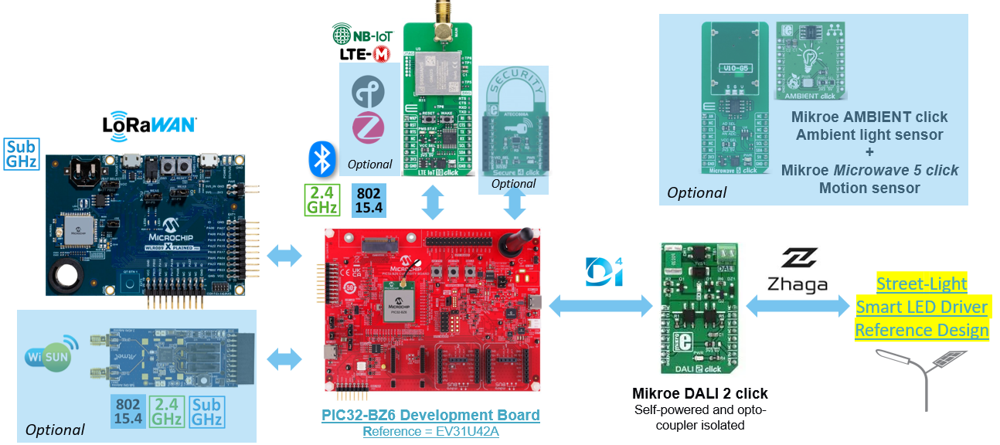


[TOP](#contents)

## Bill of Materials

| TOOLS                                                                                                                                     | QUANTITY |
| :---------------------------------------------------------------------------------------------------------------------------------------- | :------- |
| <a href="https://www.microchip.com/en-us/development-tool/ev31u42a" target="_blank">PIC32-BZ6 Curiosity Board</a>                          | 1        |
| <a href="https://www.microchip.com/en-us/development-tool/EV23M25A" target="_blank">WLR089 Xplained Pro Evaluation Kit</a>                                                         | 1        |
| <a href="https://www.mikroe.com/dali-2-click" target="_blank">DALI 2 click</a>                                                          | 1        |
|  <a href="https://www.microchip.com/en-us/tools-resources/reference-designs/smart-street-lighting-reference-design" target="_blank">Street Light Smart LED Driver Reference Design</a>                           | 1        |
| <a href="https://www.mikroe.com/lte-iot-10-click?srsltid=AfmBOopZ0oW30uIoPkGGfvCQr_8gme9cHlPF3eoJpJZLG1BN1LyVjCXD" target="_blank">LTE IoT 10 click</a> | 1           |
| <a href="https://fr.rs-online.com/web/p/antennes-gsm-et-gprs/2024210?gb=a" target="_blank">LTE Antenna</a> | 1 |
| <a href="https://soracom.io/" target="_blank">IoT SIM</a> | 1 |
| <a href="https://www.az-delivery.de/products/led-rgb-modul?_pos=1&_sid=384118f11&_ss=r" target="_blank">KY-016 FZ0455 3-Color RGB LED Module (optional)</a>    
| <a href="https://www.thethingsindustries.com/docs/hardware/gateways/" target="_blank">LoRaWAN Gateway</a> | 1 |

[TOP](#contents)

## Hardware Setup

### Overview

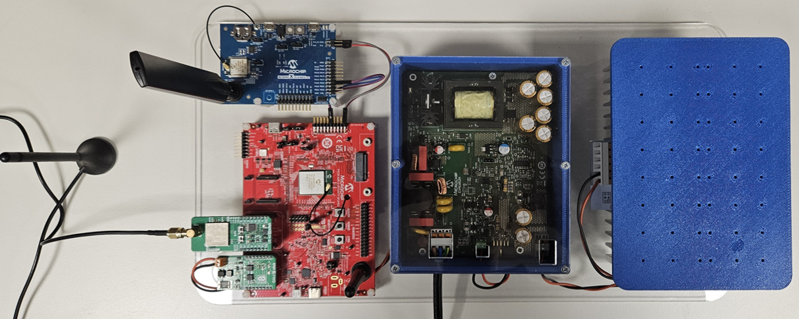
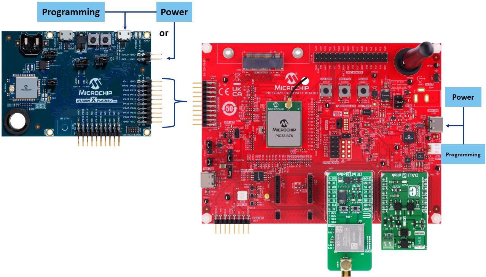

### Enable DALI connectivity

* Plug the DALI-2 click board into mikroBUS Socket #1 (J903) on the PIC32-BZ6 Curiosity board
* Connect the DALI bus to the LED Reference Design using the black and red wires

<br>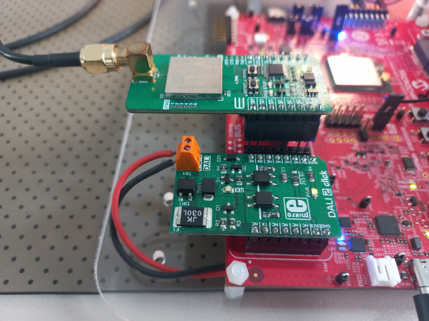

<i>Note: 
* Refer to the <a href="https://www.microchip.com/en-us/tools-resources/reference-designs/smart-street-lighting-reference-design" target="_blank">Street Light Smart LED Driver Reference Design</a> for more information. </i>

### Enable LTE-M connectivity

* Attach the LTE antenna to the SMA connector
* Use an adapted between the LTE click board and the PIC32-BZ6 Curiosity board, as several pins on the mikroBUS header are shared with other functions and must be isolated
* Plug the LTE IoT 10 click board into mikroBUS Header #2 (J905) using a socket adapter so that only the pins marked as **Connected** (shown below) are physically routed

| LTE IoT 10 click board | Connection status | mikroBUS Header #2 (J905) on the PIC32-BZ6 Curiosity board  | 
| :-                     | :-                | :-                                         |
| 1 - WKP                | **Connected**     | 1 - PB5                                    |
| 2 - RST                | **Connected**     | 2 - PC10                                   |
| 3 - RTS                | Isolated          | 3 - PB9 - shared with user button 1        |
| 4 - NC                 | Isolated          | 4 - PE5 - not used                         |
| 5 - NC                 | Isolated          | 5 - PA4 - used as external GPIO            |
| 6 - NC                 | Isolated          | 6 - PA9 - not used                         |
| 7 - 3.3V               | **Connected**     | 7 - 3.3V
| 8 - GND                | **Connected**     | 8 - GND
| 9 - GND                | **Connected**     | 9 - GND
| 10 - 5V                | **Connected**     | 10 - 5V
| 11 - SDA               | Isolated          | 11 - PA7 - shared with SERCOM1_PAD0 used for WLR089_TX |
| 12 - SCL               | Isolated          | 12 - PA8 - shared with SERCOM1_PAD1 used for WLR089_RX |
| 13 - RX                | **Connected**     | 13 - PA0/UART_TX                           |
| 14 - TX                | **Connected**     | 14 - PA1/UART_RX                           |
| 15 - CTS               | Isolated          | 15 - PE3 - shared with user button 2       |
| 16 - RI                | Isolated          | 16 - PC11 - not used                       |

### Enable LoRaWAN connectivity

* Attach the supplied antenna to the U.FL connector
* Connect the WLR089 Xplained Pro board to the PIC32-BZ6 Curiosity board according to the wiring table below
* Power up the board using either the EDBG USB connector (J400) or the 4-pin PWR header (J100)

| Signal name | PIC32-BZ6 Curiosity Board | WLR089U0 Xplained Pro Board |
| :-          | :-                        | :-                          |
| WLR089_TX   | XPRO Header (J900) Pin 11 | EXT1 (J200) Pin 13 (PA05)   |
| WLR089_RX   | XPRO Header (J900) Pin 12 | EXT1 (J200) Pin 14 (PA04)   |
| WLR089_GND  | XPRO Header (J900) Pin 19 | PWR (J100) Pin 2            |
| WLR089_VCC  | XPRO Header (J900) Pin 20 | PWR (J100) Pin 4            |

<br>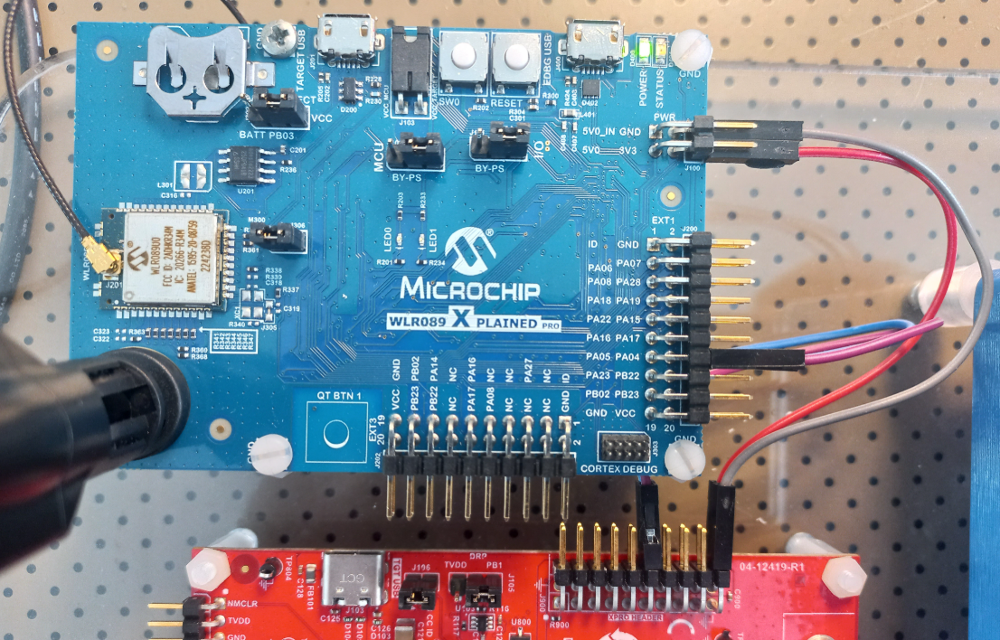

<i>Note: 
* For high‑power LoRaWAN operations (e.g., OTAA at SF12), disconnect WLR089_VCC and power the WLR089 Xplained Pro externally through the EDBG micro‑USB port
</i>

### 3-Color RGB LED Module

The optional external RGB LED module indicates the LoRaWAN connection status.

* Connect the LED module to the PIC32‑BZ6 Curiosity board as shown below

  | PIC32-BZ6 GPIO Header (J701) | RGB LED pin Header |
  | :-                           | :-                 |
  | Pin 2 (PB10)                 | G                  |
  | Pin 3 (GND)                  | GND                | 
  | Pin 13 (PB11)                | B                  |
  | Pin 24 (PB6)                 | R                  |

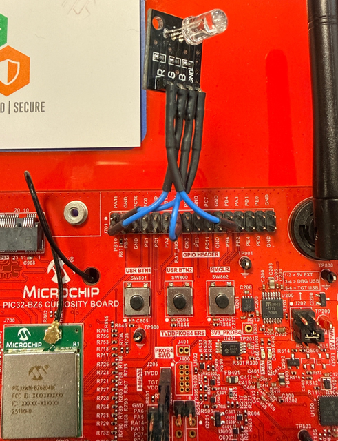

### External GPIO

The application can drive the RPA4 GPIO to control an additional actuator that is not included in the current demonstrator. The RPA4 GPIO is available on pin 17 of the XPRO header (J900).

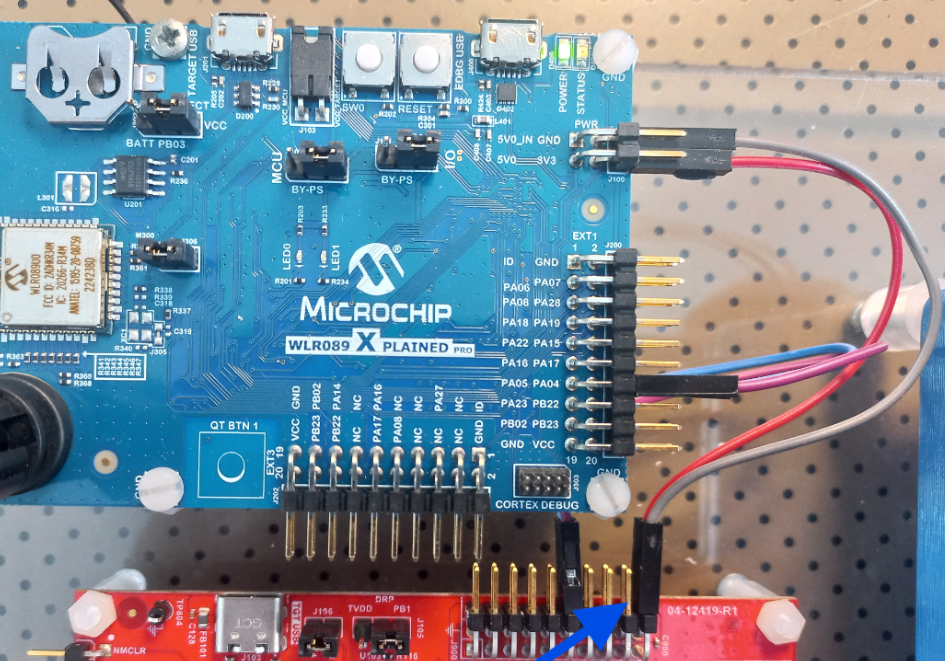


### Debug the system over UART

* Connect the USB Type‑A to USB Type‑C cable between the PC and the Debug USB port (J100)
* Serial console settings:

| Baudrate | Data | Parity | Stop bits | Flow Control |
| :-       | :-   | :-     | :-        | :-           |
| 115200   | 8    | No     | 1         | None         |

### Power the entire system

Power the entire system in the following order:

* Power the PIC32‑BZ6 Curiosity Board via the Debug USB (J100)
* Apply mains power to the LED Driver Reference Design

[TOP](#contents)

## Software Setup

### Development Tools
- <a href="https://www.microchip.com/en-us/tools-resources/develop/mplab-x-ide" target="_blank">MPLAB® X IDE v6.25</a>
- MPLAB® X IDE plug-ins: MPLAB® Code Configurator (MCC) v5.7.1 and above
- MPLAB® XC32 C/C++ Compiler v4.60
- MPLAB® Harmony v3
- Device Pack: PIC32CX-BZ6_DFP v1.2.17
- <a href="https://developerhelp.microchip.com/xwiki/bin/view/software-tools/ipe/installation/" target="_blank">MPLAB® X IPE</a>

### Additional Tools

- Any Serial terminal application like <a href="https://teratermproject.github.io/index-en.html" target="_blank">TeraTerm</a> terminal application
- <a href="https://www.microchip.com/en-us/products/wireless-connectivity/bluetooth-low-energy" target="_blank">Microchip Bluetooth Data (MBD)</a> mobile app available for <a href="https://apps.apple.com/us/app/microchip-bluetooth-data/id1319166097" target="_blank">iOS</a> and <a href="https://play.google.com/store/apps/details?id=com.microchip.bluetooth.data" target="_blank">Android</a>
- <a href="https://www.microchip.com/en-us/tools-resources/develop/microchip-studio" target="_blank">Microchip Studio IDE</a>

### MCC Content Libraries
| Harmony V3 component   | version   |
| :----------------------| :---------|
| csp                    | v3.21.0   |
| core                   | v3.14.2   |
| wireless_ble           | v1.4.0    |
| wireless_pic32cxbz_wbz | v1.5.0    |
| wireless_system_pic32cxbz_wbz | v1.7.0 |
| CMSIS_5                | v5.9.0    |
| FreeRTOS-Kernel        | v11.1.0   |

### Harmony MCC Configuration

#### Project Graph<!-- omit in toc -->

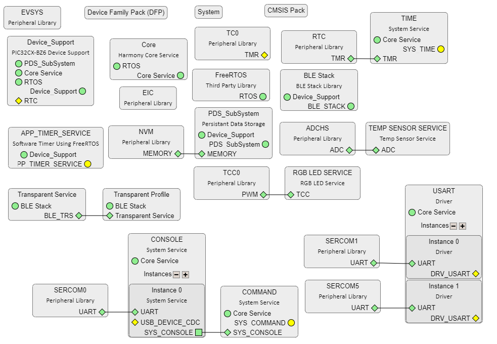

#### System Console, Debugging and Command Line Interface<!-- omit in toc -->

The system console uses SERCOM0 in USART mode and is accessible through the DEBUG USB connector.

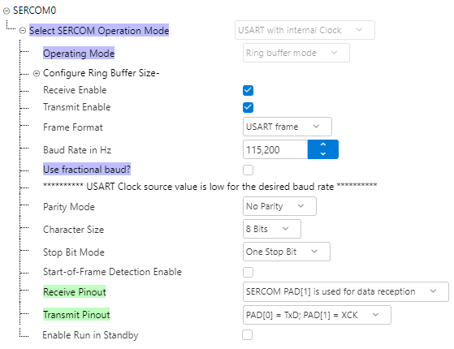

In addition to standard console functions, it supports debugging and provides a command line interface for direct interaction with the application such as controlling the light.

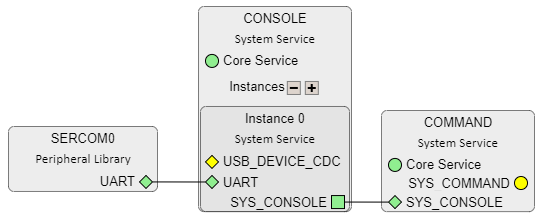

#### BLE Configuration<!-- omit in toc -->

Configured in peripheral mode, the BLE stack allows incoming connections from a central device like a mobile app.

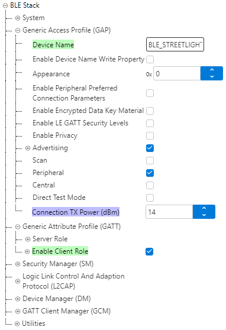

The BLE Device name defaults to `BLE_STREETLIGHT` and can be changed in MCC or directly in `configuration.h`:

`#define CONFIG_BLE_GAP_DEV_NAME_VALUE {"BLE_STREETLIGHT"}`

In addition to the BLE stack, the MCC Harmony v3 BLE component provides the Transparent UART Service Profile, enabling a simple data pipe between the BLE central device and the PIC32-BZ6 peer.

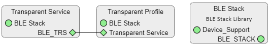

#### LTE Module Configuration<!-- omit in toc -->

The application communicates with the LTE‑M module through SERCOM5 operating in USART mode.

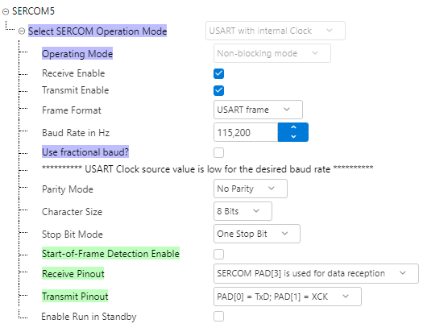

#### LoRaWAN Module Configuration<!-- omit in toc -->

The application interfaces with the LoRaWAN module using SERCOM1 configured in USART mode.

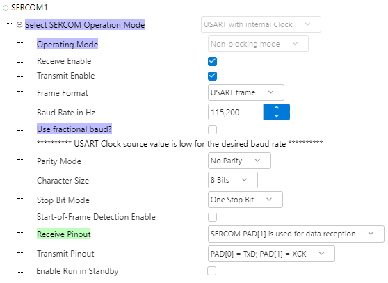

#### DALI Interface Configuration<!-- omit in toc -->

The application communicates with the light over the DALI bus using two GPIOs for transmit/receive signaling and one hardware Timer.

| PIC32-BZ6's Peripheral | Function | Configuration |
| :-                     | :-       | :-            |
| TC0                    | Timer0   | Counter in 32-bit mode, Prescaler: GCLK_TC/4 |
| RA15                   | GPIO     | DALI_TX output |
| RE4                    | EXTINT0  | DALI_RX input |

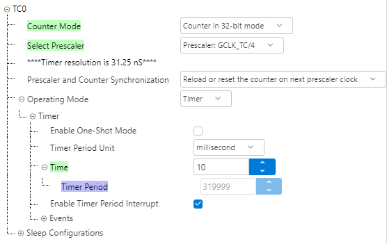

[TOP](#contents)

## Cloud Platform

### The Things Network

> The Things Network (TTN) is a global, community-driven IoT ecosystem that builds networks, devices and solutions using the LoRaWAN protocol.

Follow the steps below to create your TTN application and register your device:

#### 1. Create an account and log in<!-- omit in toc -->

Create an account on TTN and sign in to the <a href="https://www.thethingsnetwork.org/get-started" target="_blank">Console</a>.

#### 2. Create a new TTN application<!-- omit in toc -->

Follow the on-screen <a href="https://www.thethingsindustries.com/docs/integrations/adding-applications/">instructions</a> to create an application that will host your LoRaWAN devices.

#### 3. Register a new end device<!-- omit in toc -->

Select <a href="https://www.thethingsindustries.com/docs/hardware/devices/adding-devices/">Register a new device</a>, then configure the following:

##### Enter end device specifics manually<!-- omit in toc -->

- Frequency plan: Europe 863-870MHz SF9 for RX2 (recommended)
- LoRaWAN version: LoRaWAN specification 1.0.4
- Regional Parameters version: RP002 Regional Parameters 1.0.2

##### Activation method: <a href="https://www.thethingsindustries.com/docs/hardware/devices/adding-devices/manual/otaa/">OTAA</a><!-- omit in toc -->

- Additional LoRaWAN class capabilities: None (class A only)
- Network defaults: Use network's default MAC settings
- JoinEUI: enter an 8-byte wide hexadecimal JoinEUI and confirm
- DevEUI: enter or generate an 8-byte DevEUI
- AppKey: enter or generate a 16-byte AppKey
- End device ID: assign a unique name to your device

Click **Register end device** to complete the process.

#### Provisioning LoRaWAN Credentials into the PIC32-BZ6 Application<!-- omit in toc -->

You now have two options to inject the LoRaWAN credentials into the application

##### Option 1 - Update the source code<!-- omit in toc -->

Copy the activation credentials from TTN and replace the default macro values in: `app_lora_wlr089.h`

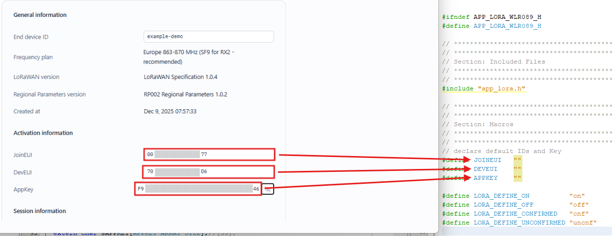

##### Option 2 - Use runtime commands<!-- omit in toc -->

Set the LoRaWAN keys using the `lorawan_set_keys <DevEUI> <JoinEUI> <AppKey>` command.

Refer to the list of [Serial console and BLE commands](#serial-console-and-ble-commands) for more details.


### Kaa IoT

> Kaa provides a unified platform for rapid, end-to-end IoT development and deployment of enterprise-grade IoT applications.

* Build your own dashboard by starting the <a href="https://www.kaaiot.com/">Kaa IoT Platform Free Trial</a>


[TOP](#contents)

## Application

### System Overview

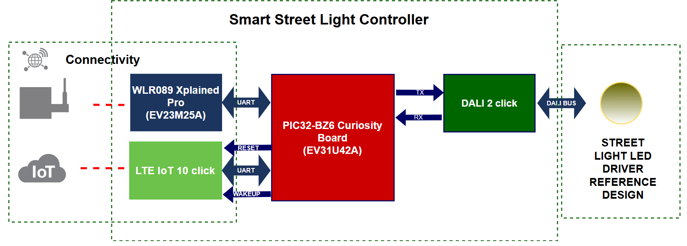

### Hardware Architecture

#### On-board Components<!-- omit in toc -->

| Component            | Description               | Behavior |
| :-                   | :-                        | :-       |
| User Blue LED (D801) | BLE connection indicator  | Solid blue: BLE connected<br>Blinking: not connected, advertising |
| User button 1 (SW801) | RGB LED Control | Button pressed: toggle the on-board RGB LED state |
| User button 2 (SW800) | LoRaWAN Join | Button pressed: trigger a LoRaWAN OTAA |

#### PIC32-BZ6 Pin Settings<!-- omit in toc -->

Below the list of available interfaces and the corresponding pin settings.

| Interface | Pin Number | Pin ID | Custom Name | Function | Settings |
| :-        | :-         | :-     | :-          | :-       | :-       |
| LTE Module| A4<br>A16<br>A23<br>B14         | RB5<br>RA0<br>RC10<br>RA1    | LTE_WAKEUP<br>LTE_UART_TX<br>LTE_RESETN<br>LTE_UART_RX  | GPIO<br>SERCOM5_PAD0<br>GPIO<br>SERCOM5_PAD3     | Out, Low<br>Out<br>Out, High<br>In  |
| On-board User Blue LED (D801) | A5 | RB7 | USER_LED | GPIO | Out, High |
| On-board User button 1 (SW801) | B28 | RB9 | - | EXTINT1 | - |
| On-board User button 2 (SW800) | A22 | RE3 | - | EXTINT3 | - |
| Serial Console (DBG USB) | A12<br>B10 | RA5<br>RA6 | VCP_TX<br>VCP_RX | SERCOM0_PAD0<br>SERCOM0_PAD1 | -<br>- |
| DALI D4i Module| A14<br>B29 | RE4<br>RA15 | DALI_RX<br>DALI_TX | EXTINT0<br>GPIO | -<br>Out, Low |
| Optional external RGB LED Module | A18<br>B4<br>B21 | RB11<br>RB6<br>RB10 | LED_BLUE<br>LED_RED<br>LED_GREEN | GPIO<br>GPIO<br>GPIO | Out, Low<br>Out, Low<br>Out, Low |
| On-board RGB LED | A23<br>B9<br>B20 | RC10<br>RC7<br>RE0 | RGB_GREEN<br>RGB_RED<br>RGB_BLUE | TCC0_WO2<br>TCC0_WO1<br>TCC0_WO4 | -<br>-<br>- |
| LoRaWAN Module | A19<br>B17 | RA7<br>RA8 | WLR089_TX<br>WLR089_RX | SERCOM1_PAD0<br>SERCOM1_PAD1 | -<br>- |
| External output | A21 | RA4 | EXT_GPIO | GPIO | Out, Low |

<i>Note: 
* RPC10 is multiplexed with the LTE_RESETN pin in this demo. As a result, RGB_GREEN is unavailable when the LTE module is enabled. If the LTE module is disabled, RGB_GREEN can be driven normally and the RGB LED is fully functional.
</i>

### Software Architecture

#### Overview<!-- omit in toc -->

The application is organized into several software blocks, including:
* The H3 BLE Stack, providing local control and maintenance features such as debugging via the mobile app.
* Drivers for the LoRaWAN module, interfaced over a UART connection.
* Drivers for the LTE-M module, also interfaced over a UART connection.
* The MBS GmbH DALI stack, enabling standardized luminaire control.
<!-- the H3 IEEE 802.15.4 wireless mesh for neighborhood-level networking -->

The DALI stack from MBS GmbH was compiled as a dedicated library specifically for this PIC32-BZ6 demo project.

<b><font color="red">Contact <a href="https://en.mbs-solutions.de/" target="_blank">MBS GmbH</a> to obtain access to the DALI software.</font></b>

#### Application Tasks<!-- omit in toc -->

This project is built using MPLAB Harmony v3 and runs on FreeRTOS. The application is structured into multiple tasks, each handling a specific system function:

| Task name      | Task size | Task priority | Task delay | Description                        |
| :-             | :-        | :-            | :-         | :-                                 |
| SYS_CMD_Tasks  | 1024      | 1             | 10 ms      | Handle the serial console commands |
| APP_Tasks      | 1024      | 1             | 12 ms      | Handle the application tasks       |
| APP_LORA_Tasks | 1024      | 1             | 12 ms      | Handle the LoRaWAN tasks           |
| APP_DALI_Tasks | 1024      | 1             | 10 ms      | Handle the DALI tasks              |
| APP_LTE_Tasks  | 1024      | 1             | 10 ms      | Handle the LTE tasks               |
| BM_Task        | 2048      | 3             | -          | The main task function for the Bluetooth module |

### Application Commands

#### Command Structure<!-- omit in toc -->

The project includes a built-in command interface that allows control of the entire application. Commands are issued by sending keywords - optionally followed by parameters - through the supported interfaces. <br>
Command keywords are case-sensitive, and paramters must not contain spaces. Hexadecimal data may be entered in either uppercase or lowercase. String parameters are also case-insensitive. Depending on the command, parameters may use decimal or hexadecimal formats. Hex values are entered directly (e.g., FF for 0xFF). Strings are entered as plain text without quotation marks.

Each interface supports a different command set, defined in the files listed below.

| Interface | Command definition file | Command support |
| :-        | :- | :- |
| Serial console | `sys_command.c` | [Serial Console and BLE Commands](#serial-console-and-ble-commands) |
| BLE peer device (MBD mobile app) | `app_trsps_handler.c` | [Serial Console and BLE Commands](#serial-console-and-ble-commands) |
| LTE | `app_lte.c` | [LTE Interface Commands](#lte-interface-commands) |
| LoRaWAN | `app_lora.c` | [LOTA Interface Commands](#lora-interface-commands) |

All four interfaces can control the on-board RGB LED, the DALI light, and the external GPIO.

<i>Notes: 
- Responses are prefixed with the command origin (e.g., [LORA]) to indicate which interface initiated the command.
- Commands executed locally on an interface (e.g., from the Serial console) produce unprefixed responses on that interface.
- Internal stack messages can appear asynchronously and are tagged with a prefix such as [DALI] to show their origin.
- The serial console and BLE interface share the same command set.
</i>

#### Serial Console and BLE Commands<!-- omit in toc -->

Issue the commands below via the serial console or the BLE mobile app.

| Command | Description | Parameter | Example | Expected Response |
| :-      | :-          | :-       | :-      | :-                |
| `help`  | Print help menu | - | help | List of supported commands |
| `reset` | Trigger a software reset | - | reset | - |
| `gl`    | Print the DALI gear level| - | gl | Actual level is ..% |
| `gs`    | Print the gear status coming from `dali_gear_reaction_callback()` in DALI stack | - | gs | Received query status<br>Addr is 0, lamp is 1<br>Gear failure is 0, lamp failure is 0 |
| `sl <level>` | Set the DALI lamp intensity in % | `<level>`: decimal value between 0 and 100 (capped at 50% by the application) | sl 10 | Setting Gear Level to 10% |
| `lamp_on` | Set the DALI lamp intensity to the latest level | - | lamp_on | Setting Gear Level to ..% |
| `lamp_off` | Turn OFF the DALI lamp | - | lamp_off |  Setting Gear Level to 0% |
| `rgb_on <HH> <SS> <VV>` | Set the RGB LED color using <a href="https://colorpicker.dev/#55FFFF" target="_blank">HSV format</a> | `<HH>`: 1-byte hexadecimal number representing the Hue value<br>`<SS>`: 1-byte hexadecimal number representing the Saturation value<br>`<VV>`: 1-byte hexadecimal number representing the Value | rgb_on AA FF FF | RGB color 0xAA |
| `rgb_off` | Turn OFF the RGB LED | - | rgb_off | RGB off |
| `lte_on` | Enable the LTE module | - | lte_on | LTE module enabled |
| `lte_off` | Disable the LTE module | - | lte_off | LTE module disabled |
| `lte_set_params <URL> <PubTopic> <SubTopic>` | Set the LTE MQTT settings | `<URL>`: string value representing the MQTT broker address<br>`<PubTopic>`: string value representing the MQTT topic for publishing messages<br>`<SubTopic>`: string value representing the MQTT topic for subscribing to incoming messages | lte_set_params test.mosquitto.org endpointId/dcx/token endpointId/dcx/token/json | LTE parameter set |
| `lte_get_params` | Print the LTE MQTT settings | - | lte_get_params | `<URL> <PubTopic> <SubTopic>` | 
| `blelog_on` | Enable BLE debug logs | - | blelog_on | Log over BLE enabled |
| `blelog_off` | Disable BLE debug logs | - | blelog_off | Log over BLE disabled |
| `lorawan_on` | Enable the LoRaWAN module | - | lorawan_on | module enabled |
| `lorawan_off` | Disable the LoRaWAN module | - | lorawan_off | module disabled |
| `lorawan_set_keys <DevEUI> <JoinEUI> <AppKey>` | Configure the LoRaWAN OTAA credentials | `<DevEUI>`: 8-byte hexadecimal value representing the device EUI<br>`<JoinEUI>`: 8-byte hexadecimal value representing the join/application EUI<br>`<AppKey>`: 16-byte hexadecimal value representing the application key | lorawan_set_keys 7004A30B001A55D6 0011223344556677 F9112233445566778899AABBCCDDEE46 | Settings the Keys ... |
| `lorawan_get_keys` | Print the LoRaWAN credentials | - | lorawan_get_keys | Getting the Keys ... |
| `lorawan_join` | Trigger a LoRaWAN OTAA | - | lorawan_join | Started to join the network ... |
| `lorawan_set_uplink <PauseSec> <UncnfMsg> <CnfMsg>` | Set the LoRaWAN transmission scheme | `<PauseSec>`: interval in seconds between consecutive uplinks (10-60)<br>`<UncnfMsg>`: number of unconfirmed uplink messages in each transmission block (0-60)<br>`<CnfMsg>`: number of confirmed uplink messages in each transmission block (0-60)| lorawan_set_uplink 60 4 1 | Uplink configuration successfully set |
| `lorawan_get_uplink` | Print the current uplink behavior | - |lorawan_get_uplink | Uplink configuration `<PauseSec> <UncnfMsg> <CnfMsg>` |
| `lorawan_start_uplink` | Start the LoRaWAN transmission | - | lorawan_start_uplink | regular message uplink started |
| `lorawan_stop_uplink` | Stop the LoRaWAN transmission | - | lorawan_stop_uplink | message uplink stopped |
| `ext_gpio_on` | Set the EXT_GPIO output to high | - | ext_gpio_on | External GPIO on |
| `ext_gpio_off` | Clear the EXT_GPIO output | - | ext_gpio_off | External GPIO off |
| `status` | Print the interfaces status | - | status | Status of Interfaces:<br>DALI - 4% intensity<br>RGB  - on, hue: 0xAA<br>LTE  - module disabled, disconnected<br>BLE  - log enabled, connected<br>LORA - module enabled, connected<br>GPIO - off |

<i>Notes: 
- The serial console adds the prefix of the interface into the response to identify the command origin.
- LoRaWAN uplinks are transmitted at a user‑defined periodic interval.
- The LoRaWAN transmission scheme consists of n unconfirmed uplink messages followed by m confirmed uplink messages.
- The LoRaWAN transmission scheme repeats indefinitely while the device remains joined to the network.
- When both `<UncnfMsg>` and `<CnfMsg>` are set to 0, the transmission scheme defaults to sending a single confirmed uplink.
</i>

#### LoRaWAN RN Parser Commands<!-- omit in toc -->

Beside the application commands listed above, the application handles <a href="https://github.com/MicrochipTech/atsamr34_lorawan_rn_parser/" target="_blank">LoRaWAN RN Parser commands</a> received via the serial console or BLE terminal and relays them directly to the WLR089U0 in passthrough mode.

#### LTE Interface Commands<!-- omit in toc -->

The default configuration for receiving MQTT commands is defined in the `app_lte.h` file.<br>
Use the `lte_set_params` command to adjust these parameters.

```c
#define LTEIOT10_MQTT_CLOUD_URL                     "\"broker.hivemq.com\""
#define LTEIOT10_MQTT_SUB_TOPIC                     "\"endpointId/dcx/token\""
```

Issue the commands below via an MQTT client to control the RGB LED, the DALI light and the External GPIO.

| Topic        | JSON key       | Type        | Description           |
| :-           | :-             | :-          | :-                    |
| set_rgb_lte  | rgb_led        | int (0/1)   | RGB LED on/off        |
| set_rgb_lte  | color          | hex string  | RGB Hue value         |
| switch_light | dali_light     | int (0/1)   | DALI light on/off     |
| switch_light | dali_intensity | int (0-100) | DALI brightness       |
| switch_gpio  | ext_gpio       | int (0/1)   | External GPIO control |

##### `set_rgb_lte` - RGB LED commands<!-- omit in toc -->
```json
{
  "rgb_led": 1,
  "color": "55"
}
```
<i>Note:
- Only Hue is updated (Saturation and Value stay unchanged)
</i>

##### `switch_light` - DALI lighting commands<!-- omit in toc -->
```json
{
  "dali_light": 1,
  "dali_intensity": 20
}
```
<i>Note:
- Intensity only applied if light is already ON and intensity is different from current value
</i>

##### `switch_gpio` - External GPIO control<!-- omit in toc -->
```json
{
  "ext_gpio": 1
}
```
The function below is defined in `app_lte.c` and performs an MQTT command parser that routes incoming messages based on the topic and then extracts JSON-like commands from the payload string. 

**`Function: static void APP_Parse_Rx_Message(char *mqttRxTopic, char *mqttRxMessage)`**

#### LORA Interface Commands<!-- omit in toc -->

The application processes LoRaWAN downlink messages in the function shown below, defined in `app_lora_wlr089.c`:

**Function: `int APP_LORA_WLR089_Rsp_SendData(parserCmdInfo_t* paramList)`**

The 4-byte LoRaWAN downlink payload format is shown below.

**Downlink Payload Format: `<ReqStatus> <Hue> <Sat> <Val>`**

- `<ReqStatus>`: 1-byte hex value indicating the requested status of the target interface
  - `0x00` - that deactivates the RGB LED
  - `0x01` - that activates the RGB LED using the current HSV color settings
  - `0x02` - that activates the RGB LED using the new HSV color settings
  - `0x03` - that turns OFF the Dali light
  - `0x04` - that turns ON the Dali light
  - `0x05` - that sets the DAli light intensity using the level from `<Val>`
  - `0x06` - that outputs a low level to the external GPIO
  - `0x07` - that outputs a high level to the external GPIO
- `<Hue>`: 1-byte hex value representing the requested RGB color Hue (00 to FF)
- `<Sat>`: 1-byte hex value representing the requested RGB color Saturation (00 to FF)
- `<Val>`: 1-byte hex value representing the requested RGB color Value (00 to FF) or the light intensity

##### TTN commands<!-- omit in toc -->

A custom JavaScript <a href="https://www.thethingsindustries.com/docs/integrations/payload-formatters/" target="_blank">payload formatter</a> is used to decode downlink messages before they are processed by the application. It is a useful feature for converting binary payloads into human-readable fields or performing other data transformations on downlinks.

```javascript
const COLOR = ["green", "blue", "yellow", "red", "off"];
function encodeDownlink(input) {

  if(input.data.color !== undefined) {
    switch(COLOR.indexOf(input.data.color)) {
      case 0: // green
        payload = [0x02, 0x55, 0xFF, 0xFF];
        break;
      case 1: // blue
        payload = [0x02, 0xAA, 0xFF, 0xFF];
        break;
      case 2: // yellow
        payload = [0x02, 0x2A, 0xFF, 0xFF];
        break;
      case 3: // red
        payload = [0x02, 0xFF, 0xFF, 0xFF];
        break;
      default: // off
        payload = [0x00, 0x00, 0x00, 0x00];
        break;
    }
  }
  else if(input.data.rgb_led !== undefined) {
    if(input.data.rgb_led == 1) {
      payload = [0x01, 0x00, 0x00, 0x00];
    } else {
      payload = [0x00, 0x00, 0x00, 0x00];
    }
  }
  else if(input.data.dali_light !== undefined) {
    if(input.data.dali_light == 1) {
      payload = [0x04, 0x00, 0x00, 0x00];
    } else {
      payload = [0x03, 0x00, 0x00, 0x00];
    }
  }
  else if(input.data.dali_intensity !== undefined) {
    payload = [0x05, 0x00, 0x00, input.data.dali_intensity];
  }
  else if(input.data.ext_gpio !== undefined) {
    if(input.data.ext_gpio == 1) {
      payload = [0x07, 0x00, 0x00, 0x00];
    } else {
      payload = [0x06, 0x00, 0x00, 0x00];
    }
  }

  return {
    bytes: payload,
    fPort: input.fPort
  };
}

function decodeDownlink(input) {
  return {
    data: {
      bytes: input.bytes
    },
    warnings: [],
    errors: []
  };
}
```

### Application Messages

The application periodically publishes messages to the cloud over both LoRaWAN and LTE.

#### LoRaWAN messages<!-- omit in toc -->

The application transmits a LoRaWAN uplink payload every `PauseSec` seconds (min: 10 s, max: 60 s). The function below is defined in `app_lora_wlr089.c` and is invoked periodically to drive the uplink transmission scheme.

**Function: `void APP_LORA_TimerTrig_Handler(void)`**

The `mac tx` API from the RN parser application running on the WLR089 is used for data transmission: 

```text
mac tx <MsgType> <portno> <data>`
```

The following 9-byte payload structure defines the content of the transmitted data.

**Uplink payload format: `<RgbOnOffStatus> <RgbColorHue> <RgbColorSat> <RgbColorVal> <TempSensMSB> <TempSensLSB> <DaliLightStatus> <DaliLightIntensity> <ExtGpioStatus>`**

- `<RgbOnOffStatus>`: 1-byte hex value representing the RGB LED status, `01` or `00`
- `<RgbColorHue>`: 1-byte hex value representing the RGB color Hue (00 to FF)
- `<RgbColorSat>`: 1-byte hex value representing the RGB color Saturation (00 to FF)
- `<RgbColorVal>`: 1-byte hex value representing the RGB color Value (00 to FF)
- `<TempSensMSB>`: 1-byte hex value representing the temperature sensor MSB
- `<TempSensLSB>`: 1-byte hex value representing the temperature sensor LSB
- `<DaliLightStatus>`: 1-byte hex value representing the DALI light status, `01` or `00`
- `<DaliLightIntensity>`: 1-byte dec value representing the DALI light intensity (0 to 100)
- `<ExtGpioStatus>`: 1-byte hex value representing the external GPIO status, `01` or `00`

##### TTN messages<!-- omit in toc -->

A custom JavaScript <a href="https://www.thethingsindustries.com/docs/integrations/payload-formatters/" target="_blank">payload formatter</a> encodes uplink data into the expected payload format for the network server. It is a useful feature for converting binary payloads into human-readable fields or performing other data transformations on uplinks.

```javascript
function decodeUplink(input) {
  if (!input.bytes || input.bytes.length === 0) return {};

  var hex = input.bytes.map(b => ('0' + b.toString(16)).slice(-2)).join('').toUpperCase();

  return {
    data: {
      byte_array: input.bytes,
      hex_payload: hex,
      ttn_dali_light: input.bytes[6],
      ttn_dali_intensity: input.bytes[7],
      ttn_rgb_status: input.bytes[0],
      ttn_rgb_color: input.bytes[1],
      ttn_ext_gpio: input.bytes[8],
    },
    warnings: [],
    errors: []
  };
}
```

#### LTE messages<!-- omit in toc -->

Defined in `app_lte.c`, the application sends telemetry data to the cloud only when a change is detected, except for the the MQTT message counter, which is transmitted every 60 seconds.

The telemetry data is stored in the global variable `APP_LTE_DATA_T app_lteData`.

| Telemetry data     | Periodic transmission | Description                 | Target topic    |
| :-                 | :-                    | :-                          | :-              |
| mqttMessCntLtem    | Every 60 seconds      | MQTT message counter        | mqttMessCntLtem |
| daliLightStatus    | On-demand             | Actual Dali light status    | dali_light      |
| daliLightIntensity | On-demand             | Actual Dali light intensity | dali_intensity  |
| rgbOnOffStatus     | On-demand             | Actual RGB LED status       | rgb_status      |
| RGB_color.Hue      | On-demand             | Actual RGB LED Color Hue    | rgb_color       |
| ext_gpio           | On-demand             | Actual Ext GPIO status      | ext_gpio        |


The default configuration for publishing MQTT messages is defined in the `app_lte.h` file.<br>
Use the `lte_set_params` command to adjust these parameters.

```c
#define LTEIOT10_MQTT_CLOUD_URL                     "\"broker.hivemq.com\""
#define LTEIOT10_MQTT_PUB_TOPIC                     "\"endpointId/dcx/token/json\""
```


[TOP](#contents)

## Board Programming

### WLR089 Xplained Pro

* Program the board with the <a href="https://github.com/MicrochipTech/atsamr34_lorawan_rn_parser/tree/master/software/MLS_1_0_P_6/Parser/parser_multiband_src_wlr089_xpro" target="_blank">RN Parser Application 1_0_P_6</a> using <a href="https://www.microchip.com/en-us/tools-resources/develop/microchip-studio" target="_blank">Microchip Studio IDE</a>.

### PIC32-BZ6 Curiosity

#### Program the precompiled hex file using MPLAB X IPE<!-- omit in toc -->

* The precompiled hex file is given in the hex folder. Follow the steps provided in the link to <a href="https://developerhelp.microchip.com/xwiki/bin/view/software-tools/ipe/production-mode/program-device/" target="_blank">program the precompiled hex file</a> using MPLAB X IPE to program the pre-compiled hex image.

#### Build and program the application using MPLAB X IDE<!-- omit in toc -->

The application folder can be found by navigating to the following path:
* "firmware\peripheral_trp_uart.X"

Select the project configuration named `without_dali`.

Follow the steps provided in the link to <a href="https://developerhelp.microchip.com/xwiki/bin/view/software-tools/ides/x/projects/building/" target="_blank">Build an program the application</a>.

[TOP](#contents)

## Run the demo

### System startup

- Power the PIC32-BZ6 Curiosity via the Debug USB (J100)
- Apply mains power to the LED Driver Reference Design
- Observe the console outputs using a serial Terminal

```text
***********************************
** Starting Street Lighting Demo **
**** Software Version: 1.1.0.0 ****
***********************************

[PDS] [Unable] to restore LORAWAN_MODULE_ENABLE, using default: on
[PDS] [Unable] to restore APPKEY, using default: 00000000000000000000000000000000
[LORA] Module enabled
[PDS] [Unable] to restore BLELOG_ENABLE configuration, using default: off

***********************************
******** Resetting WLR089 *********
***********************************

cmd: sys reset
[DALI] DALI Stack ready
rsp:
Last reset cause: System Reset Request
LoRaWAN Stack UP
SAMR34 Xpro MLS_SDK_1_0_P_6 Oct  7 2025 13:45:14

***********************************
******* Initializing WLR089 *******
***********************************

[PDS] [Unable] to restore 'PauseSec' uplink configuration, using minimum value: 10s
[PDS] [Unable] to restore 'UncnfMsg' uplink configuration, using minimum value: 1
[PDS] [Unable] to restore 'CnfMsg' uplink configuration, using minimum value: 1
cmd: mac reset 868
rsp: ok
cmd: mac get deveui
rsp: 70b3d57ed0074844
cmd: mac get joineui
rsp: 0011223344556677
cmd: mac set dr 5
rsp: ok
cmd: mac get dr
rsp: 5
cmd: mac get adr
rsp: on
```

### Interface activation

By default, the application configures the interfaces as follows:

| Interface             | Default Status |
| :-                    | :-             |
| DALI                  | 10% intensity  |
| RGB                   | OFF            |
| LTE module            | Enabled        |
| BLE debug logs        | Disabled       |
| LoRaWAN module        | Enabled        |
| External GPIO         | OFF            |

The `status` command returns the status of all interfaces.

Refer to the [list of application commands](#application-commands) for enabling or disabling these interfaces as needed.

### Control the demo from the Serial Console

The example below shows the command sequence that can be issued over the serial console to interact with and control the application after a power-on reset:
* help
* lamp_off
* ext_gpio_on
* status
* sl 5
* rgb_on AA FF FF
```text
help
 
---------- Built in commands ----------
 *** help : print help menu ***
 *** reset : Reset host ***
 *** gl : DALI - get gear level ***
 *** gs : DALI - get gear status ***
 *** sl : DALI - set lamp intensity ***
 *** lamp_on : DALI - turn on lamp ***
 *** lamp_off : DALI - turn off lamp ***
 *** rgb_on : RGB LED - turn on with HSV color ***
 *** rgb_off : RGB LED - turn off ***
 *** lte_on : LTE - enable module ***
 *** lte_off : LTE - disable module ***
 *** lte_set_params : LTE - set parameters ***
 *** lte_get_params : LTE - get parameters ***
 *** blelog_on : BLE - enable logs ***
 *** blelog_off : BLE - disable logs ***
 *** lorawan_on : LORA - enable module ***
 *** lorawan_off : LORA - disable module ***
 *** lorawan_set_keys : LORA - set credentials ***
 *** lorawan_get_keys : LORA - get credentials ***
 *** lorawan_join : LORA - join network ***
 *** lorawan_set_uplink : LORA - set regular uplink behavior ***
 *** lorawan_start_uplink : LORA - start regular uplink behavior ***
 *** lorawan_stop_uplink : LORA - stop regular uplink behavior ***
 *** ext_gpio_on : GPIO - set external GPIO ***
 *** ext_gpio_off : GPIO - clear external GPIO ***
 *** status : get status of interfaces ***
lamp_off
[DALI] Setting Gear Level to 0%
ext_gpio_on
External GPIO on
status
Status of Interfaces:
DALI - lamp off
RGB  - off
LTE  - module disabled, disconnected
BLE  - log enabled, connected
LORA - module enabled, connected
GPIO - on
sl 5
[DALI] Setting Gear Level to 5%
rgb_on AA FF FF
RGB color 0xAA
```

<!-- <br>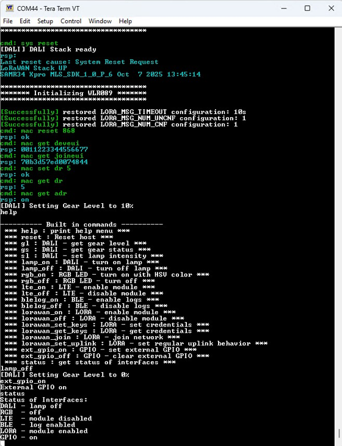 -->


### Configure the LoRaWAN device

1. Enable the interface using the `lorawan_on` command if needed
2. Issue the `lorawan_set_keys <DevEUI> <JoinEUI> <AppKey>` command to configure the LoRaWAN OTAA credentials
3. Customize the transmission scheme using the `lorawan_set_uplink` command if required
4. Initiate a LoRaWAN activation via the `lorawan_join` command or via the [User button 2](#on-board-components)
5. Monitor the connection status through the serial console or the optional [external RGB LED module](#3-color-rgb-led-module)
6. Once connected, the application sends uplink messages at a user‑defined periodic interval starting with n unconfirmed messages followed by m confirmed messages as defined in the transmission scheme

Refer to the list of [Serial console and BLE commands](#serial-console-and-ble-commands) for more details.

### Configure the LTE MQTT server

1. Enable the interface using the `lte_on` command if needed
2. Configure the MQTT broker parameters of your choice by issuing `lte_set_params <URL> <PubTopic> <SubTopic>`
3. In case new MQTT parameters are set, the application is restarting automatically the LTE state machine
4. Monitor the connection status through the console output

Refer to the list of [Serial console and BLE commands](#serial-console-and-ble-commands) for more details.

### Control the demo from the MBD mobile app

1. Enable the debug logs over BLE if needed using the `blelog_on` command
2. Launch the MBD mobile app
3. Follow the steps shown below in the MBD mobile app flow

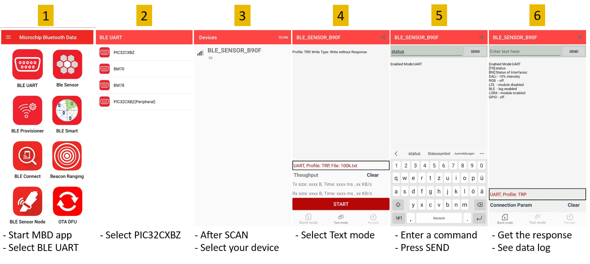

### Control the demo from the TTN console

#### Monitor the uplink messages<!-- omit in toc -->

Observe the uplink messages sent by the device on the `Live data` page.

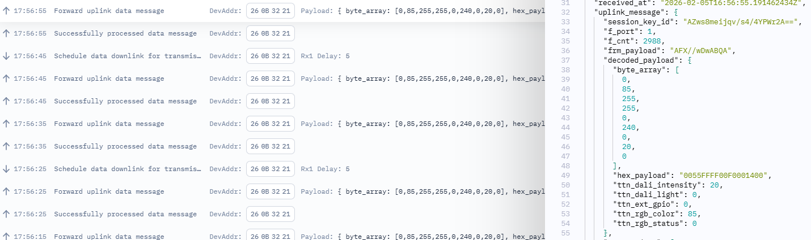

#### Push downlink messages to the device<!-- omit in toc -->

Schedule a downlink message to the device from the `Messaging` page.

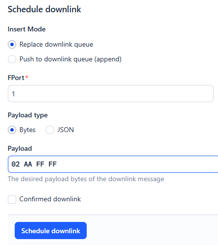

### Control the demo from the GUI

The Street Lighting dashboard for this demo has been created using the <a href="https://www.kaaiot.com/" target="_blank">Kaa IoT Platform</a>. 

The IoT dashboard provides real-time monitoring and control of the lighting devices using two connectivity paths. Application data are published via LTE-M using MQTT directly to the Kaa IoT Platform, while LoRaWAN data are forwarded through The Things Network and automatically integrated into Kaa IoT. The dashboard visualizes live telemetry, device status, and enables remote control commands regardless of the underlying network.

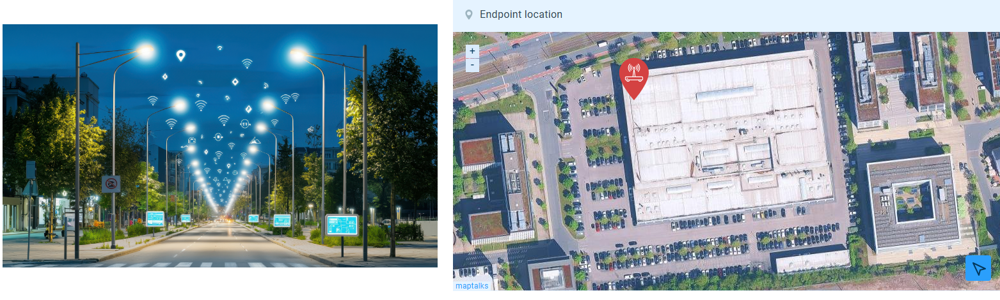<br>
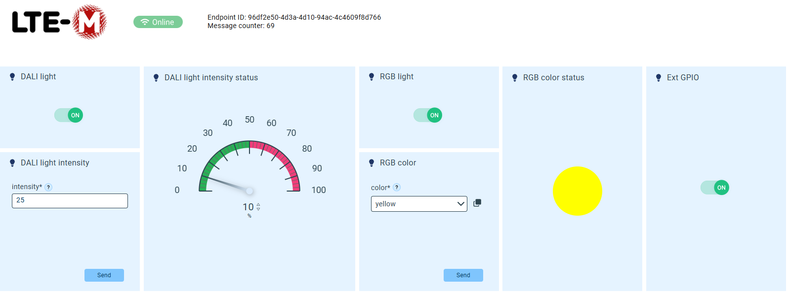<br>
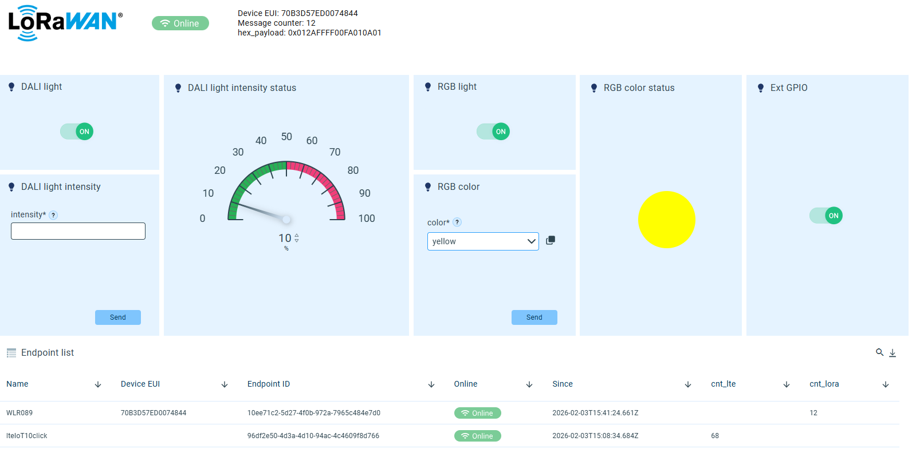

### Troubleshootings

#### DALI light driver not responding on the DALI bus<!-- omit in toc -->

- Disconnect the LED light from mains power and wait for the `BUSPOWER_OFF` event (bus voltage drops after ~15 seconds).
- Reconnect the LED light.

#### RGB LED does not turn OFF<!-- omit in toc -->

In this demo, pin RPC10 is multiplexed with LTE_RESETN. When the LTE module is enabled, RGB_GREEN cannot be controlled, preventing the RGB LED from turning fully off.
When the LTE module is disabled, RGB_GREEN behaves normally, and the RGB LED operates correctly.

[TOP](#contents)

## Related links

### Smart Street Lighting Applications<!-- omit in toc -->
- <a href="https://www.microchip.com/en-us/solutions/sustainability/street-lighting" target="_blank">Smart Street Lighting Applications</a>
- <a href="https://www.microchip.com/en-us/tools-resources/reference-designs/smart-street-lighting-reference-design" target="_blank">Street Light Smart LED Driver Reference Design</a>
- <a href="https://www.microchip.com/en-us/tools-resources/reference-designs/smart-street-light-controller-demonstration-application" target="_blank">Smart Street Light Controller Demonstration Application</a>

### Wireless MCU with Advanced Peripherals<!-- omit in toc -->
- <a href="https://www.microchip.com/en-us/products/microcontrollers/32-bit-mcus/pic32-sam/pic32-bz6" target="_blank">PIC32-BZ6 Wireless Microcontrollers (MCUs)</a>
- <a href="https://www.microchip.com/en-us/development-tool/ev31u42a" target="_blank">PIC32-BZ6 Curiosity Board</a>
- <a href="https://onlinedocs.microchip.com/oxy/GUID-657D3893-6C33-47F8-978B-86DB297AC33D-en-US-4/index.html" target="_blank">PIC32-BZ6 Application Developer's Guide</a>
- <a href="https://github.com/Microchip-MPLAB-Harmony/wireless_apps_pic32_bz6" target="_blank">PIC32-BZ6 H3 Application Examples</a>

### LoRaWAN<!-- omit in toc -->
- <a href="https://www.microchip.com/en-us/product/wlr089u0" target="_blank">WLR089U0 Low Power LoRa(r) Sub-GHZ Module</a>
- <a href="https://www.microchip.com/en-us/development-tool/EV23M25A" target="_blank">WLR089 Xplained Pro Evaluation Kit</a>

### Cloud Platforms<!-- omit in toc -->
- <a href="https://www.thethingsnetwork.org/" target="_blank">The Things Network</a>
- <a href="https://www.kaaiot.com/" target="_blank">Kaa IoT Platform</a>

### LTE-M<!-- omit in toc -->
- <a href="https://www.mikroe.com/lte-iot-10-click" target="_blank">LTE IoT 10 click</a>
- <a href="https://sequans.com/chipset-module/monarch/#monarch-modules" target="_blank">Sequans Monarch 2 GM02S Module</a>

### DALI<!-- omit in toc -->
- <a href="https://www.mikroe.com/dali-2-click" target="_blank">DALI 2 Click</a>
- <a href="https://en.mbs-solutions.de/dali-stack" target="_blank">DALI Software Stack from MBS GmbH</a>
- <a href="https://en.mbs-solutions.de/s/2024-12-30_DALI_stack_Datenblatt_EN.pdf" target="_blank">MBS DALI Stack Datasheet</a>
- <a href="https://en.mbs-solutions.de/s/DALI_LowLevel_17_EN.pdf" target="_blank">MBS DALI Low Level Driver</a>

### Sensors<!-- omit in toc -->
- <a href="https://www.mikroe.com/microwave-5-click" target="_blank">Microwave 5 click</a>
- <a href="https://www.mikroe.com/ambient-click" target="_blank">Ambient click</a>

[TOP](#contents)

